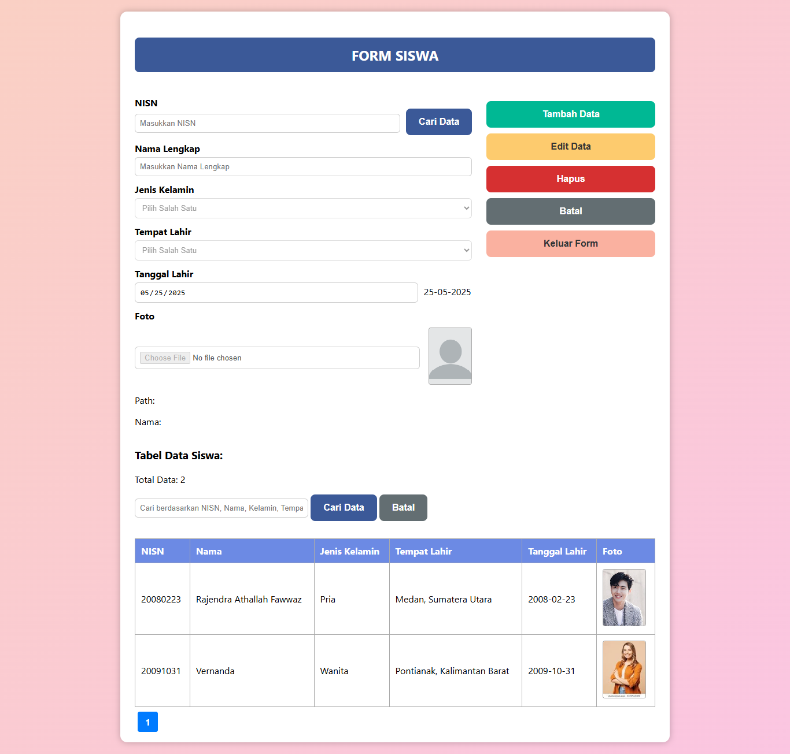

# 📋 Aplikasi Form Siswa PHP

Sebuah aplikasi berbasis web menggunakan **PHP**, **MySQL**, dan **HTML/CSS** untuk melakukan input, pencarian, pengeditan, dan penghapusan data siswa, termasuk upload foto dan tampilan data dalam bentuk tabel dengan fitur pagination.

## ✨ Fitur Utama

* 🔍 Pencarian data siswa berdasarkan NISN, nama, jenis kelamin, tempat dan tanggal lahir.
* 📄 Form input siswa dengan validasi.
* 📷 Upload dan pratinjau foto siswa.
* ✏️ Edit data siswa dengan deteksi perubahan dan validasi.
* 🗑️ Hapus data siswa.
* 📃 Tabel data siswa dengan pagination.
* 💾 Penyimpanan data menggunakan database MySQL.
* 💬 Notifikasi sukses/gagal via pesan dan modal.

## 🛠️ Teknologi yang Digunakan

* PHP (tanpa framework)
* MySQL
* HTML5
* CSS3
* JavaScript (untuk modal dan UI interaksi)

## ⚙️ Instalasi

1. **Clone repo ini** atau salin ke folder lokal server:

   ```bash
   git clone https://github.com/namauser/form-siswa-php.git
   ```

2. **Buat database MySQL** bernama `form_siswa` dan impor struktur tabel:

   ```sql
   CREATE TABLE siswa (
     nisn VARCHAR(20) PRIMARY KEY,
     nama VARCHAR(100),
     kelamin ENUM('Pria','Wanita'),
     tempatLahir VARCHAR(100),
     tanggalLahir DATE,
     image VARCHAR(255)
   );
   ```

3. **Atur koneksi database** di file `koneksi.php`:

   ```php
   $conn = new mysqli("localhost", "root", "", "form_siswa");
   ```

4. **Buat folder `uploads/`** di root project dan beri izin tulis:

   ```bash
   mkdir uploads
   chmod 755 uploads
   ```

5. **Buka di browser** melalui `localhost`:

   ```
   http://localhost/form-siswa-php/index.php
   ```

## 🧾 Struktur Folder

```
form-siswa-php/
├── index.php
├── koneksi.php
├── uploads/
│   └── default.png
├── assets/
│   └── style.css
├── README.md
```

## 📷 Contoh Tampilan

> 

## 📌 Catatan

* File foto disimpan di folder `uploads/`.
* Jika foto tidak diupload, sistem akan menampilkan `default.png`.
* Form hanya bisa diedit jika tombol "Edit Data" diklik, untuk mencegah perubahan tidak disengaja.